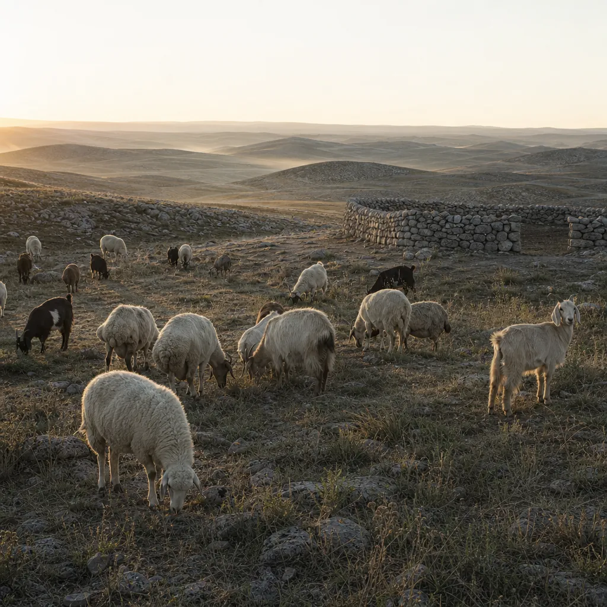

# 1 Peter 5 - Background & Links

*The highland pasture of interior Asia Minor, where Peter's congregations were scattered.*

**Passage snapshot**  
The letter closes by turning to the people who lead. Elders are told how to shepherd a congregation under pressure, everyone is told to put on humility, and the whole thing is placed under a mighty hand that will lift them up in due time. Then greetings, from Babylon.

## Map of the text
- 5:1-4: Peter addresses elders as a fellow elder and witness of Christ's sufferings: shepherd the flock among you, exercising oversight willingly not under compulsion, eagerly not for shameful gain, as examples not as domineering; the chief Shepherd will bring an unfading crown of glory.
- 5:5-7: The younger to the elders; all of them to clothe themselves with humility, since God opposes the proud and gives grace to the humble; humble yourselves under God's mighty hand so he may exalt you at the proper time; cast all your anxieties on him, because he cares for you.
- 5:8-9: Be sober-minded and watchful; the adversary prowls like a roaring lion; resist him firm in faith, knowing the same sufferings are being borne by the brotherhood throughout the world.
- 5:10-11: After you have suffered a little while, the God of all grace will himself restore, confirm, strengthen and establish you.
- 5:12-14: Silvanus named as the hand behind the letter; greetings from "she who is at Babylon" and from Mark; greet one another with the kiss of love; peace to all who are in Christ.

## Historical background (what a first-century hearer would notice)
- "Babylon" (5:13) is almost certainly Rome. Jewish writing after 70 AD regularly used the name for the imperial power that destroyed the temple, and the usage was current earlier; nobody in Peter's audience would have pictured the Mesopotamian ruin.
- Shepherd language for leaders was not a gentle pastoral metaphor. Ezekiel 34 is a furious indictment of Israel's shepherds for feeding themselves off the flock, and Peter's three contrasts - compulsion, shameful gain, domineering - track the failures Ezekiel names.
- *Archipoimen*, "chief Shepherd" (5:4), is a rare word. It appears in Greek documentary texts for the head of a shepherding operation, which keeps the image concrete: the elders are undershepherds answering to an owner.
- The "unfading crown" is a *stephanos*, the woven victor's wreath from games and civic honours, which withered within days. Calling it unfading is a deliberate contrast with the honours their neighbours competed for and which they had forfeited by leaving civic life.
- "Clothe yourselves with humility" uses a verb associated with tying on an apron, the garment of a household slave. For a congregation being told to accept low social standing, the image is pointed rather than merely poetic.
- 5:5 quotes Proverbs 3:34 in its Greek form, which reads "God opposes the proud" where the Hebrew has "he scorns the scorners". James 4:6 quotes the same Greek line, suggesting a shared stock of early Christian teaching.

## Audience needs (why this mattered to them)
- Congregations under sustained social hostility are vulnerable to two failures: leaders who exploit the group's dependence, and members who turn on each other. Chapter 5 addresses both, in that order.
- "Cast all your anxieties on him" is addressed to people with concrete anxieties - lost trade, hostile families, an uncertain future - and it is grammatically tied to the humbling of 5:6 rather than being free-standing comfort.
- 5:9 does something specific for an isolated minority: it tells them the same sufferings are being borne by the brotherhood throughout the world. Their experience is not a local judgement on them.
- 5:10 sets a boundary on the suffering ("a little while") and then stacks four verbs of restoration, which is the letter's whole argument compressed into a sentence.

## Canonical placement
- New covenant era, in the settled but pressured life of Gentile-majority congregations across Asia Minor, with an apostolic generation beginning to hand over to local elders.
- The chapter completes a movement running from 2:25, where the readers were "straying sheep" who returned to the Shepherd and Overseer of their souls. Now the flock has undershepherds, and the same two words reappear.
- Peter writing "shepherd the flock" carries its own weight given John 21:15-17, where he is the one told three times to feed the sheep.

## Scripture links
- Shepherds who exploit the flock: Ezek 34:1-10, with God himself as shepherd in 34:11-16.
- Peter commissioned to shepherd: John 21:15-17.
- Proverbs 3:34 quoted at 5:5, as also at Jas 4:6.
- Casting your burden on the LORD: Ps 55:22.
- The mighty hand of God: Exod 13:9 and Deut 9:26, exodus language now applied to a scattered church.
- The Shepherd and Overseer of souls: 1 Pet 2:25, which this chapter answers.
- The gentle shepherd carrying the lambs: Isa 40:11.

## Message to the first hearers
- Leadership in a pressured community is defined by what it refuses: coercion, profit and domination. What remains is example, which cannot be exercised at a distance.
- Humility is not resignation to their low status; it is voluntary placement under God's hand, with a promised lifting at a time they do not choose.
- The anxiety is taken seriously enough to be named and then handed over, rather than argued away.
- Their suffering has a horizon and a companion body. It lasts "a little while", and it is shared by believers across the empire, which for a scattered minority may have been the most steadying sentence in the letter.
