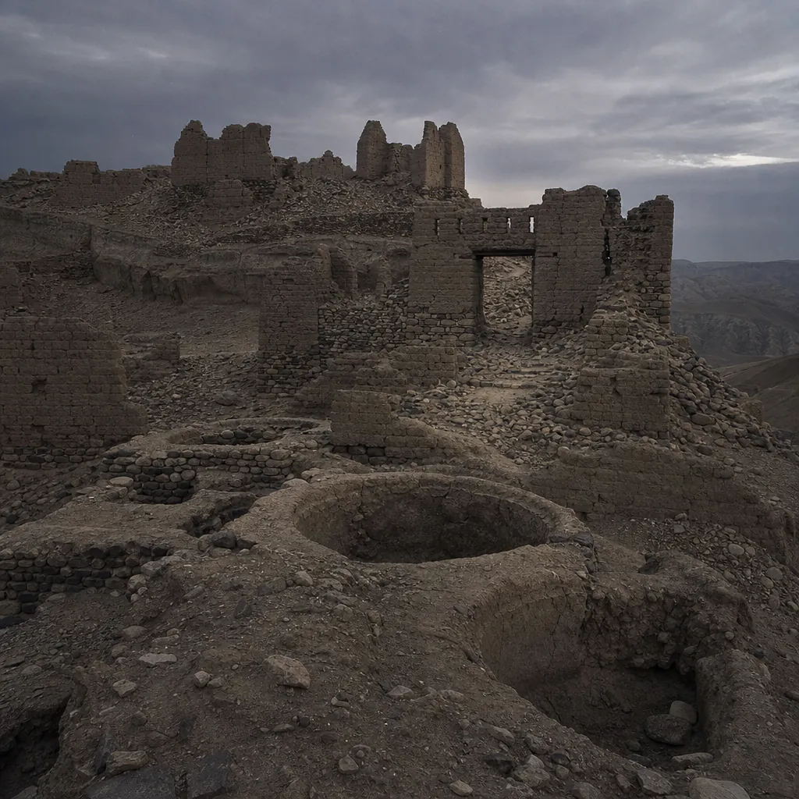

# Isaiah 24 - Background & Links

*The city of chaos broken down, its wine vats dry (24:10-11).*

**Passage snapshot**  
The opening movement of the "Isaiah Apocalypse" (chs 24-27). After twelve chapters of oracles against named nations, the lens pulls back and the whole earth comes under judgement, ending with the LORD reigning on Mount Zion before his elders in glory.

## Map of the text
- 24:1-3: The LORD empties and twists the earth and scatters its inhabitants.
- 24:4-6: The reason. The earth is defiled under its inhabitants, who transgressed laws, violated the statute, broke the everlasting covenant; therefore a curse devours the earth.
- 24:7-13: The failure of festivity. New wine dries up, music stops, the "city of chaos" is broken; what is left is a gleaning, like the last olives after beating the tree.
- 24:14-16a: A sudden counter-voice - survivors from the west lift their voices, "Glory to the Righteous One".
- 24:16b-20: The prophet refuses the consolation: "I waste away". Terror, pit, and snare; the windows of heaven open; the earth staggers like a drunkard and falls.
- 24:21-23: The LORD punishes the host of heaven above and kings below, imprisons them, and reigns on Zion; moon and sun are abashed.

## Historical-cultural background (what an ancient Israelite would notice)
- The Hebrew *eretz* means both "land" and "earth", and the chapter exploits the ambiguity. A hearer schooled on judgement against Judah's land suddenly finds the same language stretched over the whole world.
- The social levelling of 24:2 - priest like people, master like slave, creditor like debtor - dismantles every category that ordered ancient life. No status protects anyone.
- "Everlasting covenant" (24:5) is not Sinai. Sinai was given to Israel, but here *all* the earth's inhabitants stand guilty, which points to the Noahic covenant of Genesis 9:16, made with all flesh. Humanity as such is in breach.
- "The windows of heaven are opened" (24:18) is flood vocabulary lifted straight from Genesis 7:11. The city called *qiryat tohu*, city of chaos (24:10), reaches back to the *tohu* of Genesis 1:2. This is de-creation, deliberately narrated in reverse.
- Punishing "the host of heaven" alongside earthly kings (24:21) assumes the ancient view that nations stand under spiritual powers. Both tiers fall together.

## Audience needs (why this mattered to Judah)
- Judah lived as a small state between Assyrian and later Babylonian power, watching empires that seemed answerable to no one. Chapters 13-23 had already named them one by one; chapter 24 supplies the verdict none of them escape.
- It answers the suspicion that YHWH is merely a national deity with a local jurisdiction. If he judges the earth and its spiritual powers, then Judah's disasters are not evidence of his weakness.
- It refuses cheap comfort. The prophet hears the survivors' song and still says "I waste away" (24:16). An audience in real distress is not told to sing before the grief has run its course.
- The final image is the point of it all: not annihilation, but a King enthroned in Zion whose glory dims the sun.

## Canonical placement
- Structurally the hinge of Isaiah 13-27: judgement on the nations resolves into cosmic judgement, which resolves into the Zion banquet of 25:6-8 where death itself is swallowed up.
- It reaches back past Abraham to Noah and to creation, and forward to the Day of the LORD proclaimed by the later prophets.
- The pairing of universal judgement with a preserved, singing remnant is the pattern the whole biblical storyline follows from flood to exile to new creation.

## Scripture links
- Flood and Noahic covenant: Gen 7:11 (windows of heaven); Gen 9:16 (everlasting covenant with all flesh).
- De-creation: Gen 1:2; and closely paralleled in Jer 4:23-26 and Zeph 1:2-3.
- Levelling of ranks: Hos 4:9, "like people, like priest".
- The banquet that answers this chapter: Isa 25:6-8, quoted at 1 Cor 15:54 and echoed in Rev 21:4.
- Revelation draws on this chapter heavily: the staggering earth and cosmic signs (Rev 6:12-14; 16:18-20), powers imprisoned in a pit and visited after many days (Rev 20:1-3), and a city needing neither sun nor moon (Rev 21:23).
- The LORD reigning before his elders in glory (24:23) anticipates Isa 52:7 and the elders around the throne in Rev 4:4.

## Message to the first hearers
- The covenant broken here is the one made with all humanity, so the judgement is not tribal favouritism running the other way. It falls on everyone because everyone is implicated.
- Empires are not the top of the chain. The powers behind them are judged in the same sentence as the kings in front of them.
- Grief and hope are allowed to coexist. The prophet sings and wastes away in consecutive verses, and Scripture lets both stand.
- The end of the story is a throne on Zion, not an empty earth. Judgement clears the ground for a reign, and the next chapter sets a table on it.
