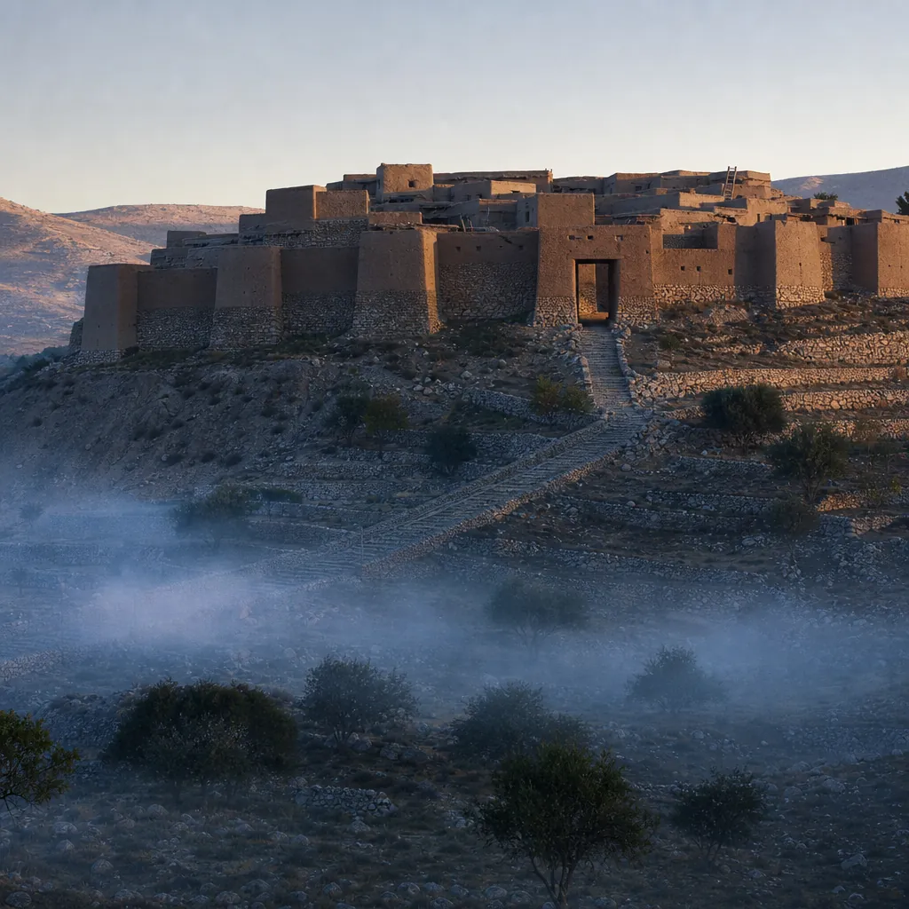

# Isaiah 26 - Background & Links

*"Open the gates, that the righteous nation which keeps faith may enter" (26:2).*

**Passage snapshot**  
A song to be sung in Judah on the far side of the judgement of chapters 24 and 25. Two cities stand against each other, one strong with salvation for walls and one levelled to the dust, and between them a people waiting through the night, promised that their dead will rise.

## Map of the text
- 26:1-6: The song. A strong city with salvation for walls and bulwarks; open the gates for the righteous nation that keeps faith; perfect peace for the mind stayed on God; an everlasting rock; the lofty city laid low and trampled by the feet of the poor.
- 26:7-11: The way of the righteous is level; waiting in the path of God's judgements; the soul yearning in the night; when God's judgements are in the earth the inhabitants learn righteousness, though the wicked will not.
- 26:12-15: Other lords have ruled over us, but only your name we confess; those other lords are dead and will not rise; the nation has been enlarged.
- 26:16-18: Distress like a woman in labour, and the bitter admission - "we were with child, we writhed, but we gave birth to wind"; we have accomplished no deliverance for the earth.
- 26:19: "Your dead shall live; their bodies shall rise"; dew of light; the earth will give birth to the shades.
- 26:20-21: Enter your chambers, shut the doors, hide for a little while until the fury has passed; the LORD is coming out, and the earth will disclose the blood shed upon it.

## Historical-cultural background (what an ancient Israelite would notice)
- The two-city contrast runs straight through chapters 24 to 27: the city of chaos broken down (24:10), the fortified city made a heap (25:2), and now the strong city whose walls are salvation itself (26:1). Judah's own walls had proved inadequate; the song relocates security.
- "Salvation for walls and bulwarks" would land hard in a country that had watched Assyrian siege ramps go up. Lachish fell to exactly that engineering, and Jerusalem's survival in 701 was not attributed to its masonry.
- Birth-pang imagery for national crisis was standard prophetic vocabulary, but 26:18 does something unusual with it: the labour produces nothing. Wind. This is a confession of failure, not a complaint about circumstance.
- The dead who "will not rise" in 26:14 are the tyrant lords of 26:13. Ancient Near Eastern kings expected an honoured afterlife and a remembered name; the song denies them both, then turns and grants precisely that to God's own dead in 26:19.
- 26:19 is among the clearest statements of bodily resurrection in the Old Testament, and its placement matters: it answers the failed labour of the previous verse. What Israel could not bring forth, God will.
- "Enter your chambers... until the fury has passed" (26:20) uses the language of the Passover night, when Israel stayed behind shut doors while judgement moved through Egypt.

## Audience needs (why this mattered to Judah)
- A people who had tried and failed to secure themselves politically needed a definition of the strong city that did not depend on their own competence.
- They needed permission to admit the failure plainly. 26:18 is the honest verse: we laboured, and we delivered nothing.
- They needed the night named. "My soul yearns for you in the night" (26:9) is not a metaphor for mild difficulty; it is the posture of people whose deliverance has not yet come.
- Above all they needed to know that death did not have the last word over the covenant people, when it demonstrably did have the last word over their oppressors.

## Canonical placement
- The third movement of the "Isaiah Apocalypse" (chs 24-27), following the earth emptied (24) and the banquet with death swallowed up (25).
- 26:19 develops 25:8 from a promise about death in general into a promise about *these* dead, and the line runs on to Daniel 12:2, Ezekiel 37 and the resurrection chapters of the New Testament.
- The waiting posture of 26:8-9 becomes the settled shape of biblical hope: judgement announced, deliverance promised, the people told to trust through an interval they cannot shorten.

## Scripture links
- Death swallowed up: Isa 25:8, which 26:19 answers directly.
- Resurrection: Dan 12:2; Ezek 37:1-14; and the New Testament development in 1 Cor 15:20-23.
- Hiding until the wrath passes: Exod 12:22-23, the Passover night behind shut doors.
- Blood disclosed by the earth: Gen 4:10, Abel's blood crying from the ground; taken up again at Rev 6:9-10.
- Trust in the everlasting rock: Deut 32:4; Ps 18:2.
- The level path of the righteous: Prov 4:25-27; Isa 40:3-4.

## Message to the first hearers
- Security is a person, not a wall. The city is strong because salvation is its rampart, which is a claim Judah could only test by losing the other kind.
- Honest failure is allowed into the song. "We gave birth to wind" is sung in worship, not confessed in private.
- The interval is real and it is bounded. "A little while" is not a denial that the fury is happening; it is a statement about how long it lasts.
- Death is not symmetrical. The oppressors stay down; God's people get up. That asymmetry is the hinge the whole chapter turns on.
