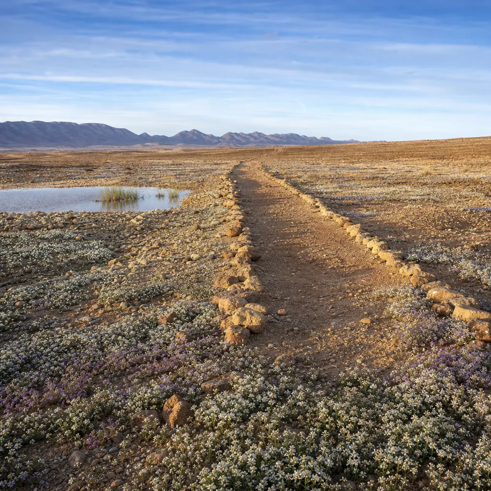

# Isaiah 35 - Background & Links

*"A highway shall be there, and a way, and it shall be called the Way of Holiness" (35:8), running through a desert in bloom.*

**Passage snapshot**  
A short poem set directly against the scorched Edom of the previous chapter. The desert flowers, the frightened are told to be strong, blind eyes and deaf ears and lame legs and silent tongues are all reversed, water breaks out where jackals lay, and a clean road runs through the middle of it carrying ransomed people home to Zion with singing.

## Map of the text
- 35:1-2: The wilderness, the dry land and the Arabah rejoice and blossom like the crocus; they are given the glory of Lebanon and the majesty of Carmel and Sharon, and they see the glory of the LORD.
- 35:3-4: Strengthen the weak hands, make firm the feeble knees; say to those with an anxious heart, "Be strong, fear not. Behold, your God will come with vengeance, with the recompense of God. He will come and save you."
- 35:5-6a: The eyes of the blind opened, the ears of the deaf unstopped, the lame leaping like a deer, the tongue of the mute singing for joy.
- 35:6b-7: Waters break out in the wilderness, streams in the desert; burning sand becomes a pool, thirsty ground springs of water; in the haunt of jackals, grass becomes reeds and rushes.
- 35:8-9: A highway called the Way of Holiness; the unclean will not travel it; it belongs to those who walk the way, and even fools will not go astray; no lion, no ravenous beast; the redeemed walk there.
- 35:10: The ransomed of the LORD return and come to Zion with singing, everlasting joy on their heads; they obtain gladness and joy, and sorrow and sighing flee away.

## Historical-cultural background (what an ancient Israelite would notice)
- Chapters 34 and 35 are a matched pair, and the second is unreadable without the first. Edom's streams turn to pitch and its land to burning sulphur (34:9); thorns and nettles take its strongholds, and it becomes "the haunt of jackals" (34:13). Chapter 35 takes each image back: the jackals' haunt grows reeds (35:7), and the wasteland blossoms. One landscape is unmade, the other remade, in adjacent columns.
- Lebanon, Carmel and Sharon were the three best-watered regions the audience knew - cedar forest, wooded ridge and coastal plain. Handing their glory to the Arabah, the arid rift running south from the Dead Sea, is the most extravagant reversal the geography allowed.
- Deserts were not empty in the ancient imagination; they were dangerous. Lions were still present in the Levant, and travel between settlements meant real exposure to predators and bandits. Promising a road with no ravenous beast on it (35:9) is a promise about safe passage, not scenery.
- Great powers built processional roads for their gods - Babylon's Processional Way carried Marduk's image at the New Year, and Assyria maintained royal roads across its empire. Isaiah's highway inverts the picture: the road is not for carrying a god's statue in, but for carrying God's people home.
- The four healings of 35:5-6 are not a general list of ailments. Blindness and deafness have been Isaiah's running metaphor for the people's condition since his commission "make the heart of this people dull, and their ears heavy, and blind their eyes" (6:10). What was imposed as judgement is here undone.
- "The unclean shall not pass over it" would be heard in temple terms. Purity language usually guards a sanctuary; here it guards a road, as though the whole route to Zion has become holy ground.
- The Hebrew of 35:8 is knotty, and translations differ over whether fools are excluded from the way or kept from wandering off it. The likelier reading is the generous one: the road is so plainly marked that even a fool cannot lose it, which is the opposite of how wisdom literature normally speaks about fools.
- Many scholars read chapters 34-35 as a later bridge, written in the language and outlook of chapters 40-55 and placed here to prepare for them. Whether or not that is right, the effect is deliberate: 35:10 will be repeated word for word at 51:11.

## Audience needs (why this mattered to Judah)
- "Say to those who have an anxious heart" (35:4) is the pastoral centre of the chapter. It is addressed to people whose hands and knees have already given way, and it does not ask them to generate their own courage; someone else is told to speak to them.
- A people facing deportation needed to know the direction of travel was reversible. The Assyrian and later Babylonian roads ran one way, away from Zion. This poem puts a road going back.
- Vengeance and salvation arrive in the same sentence (35:4). For a small nation watching empires operate with impunity, the promise that God will come "with recompense" is not an embarrassment to be explained away; it is the guarantee that the account will be settled by someone other than themselves.
- The chapter deals in permanence where their experience dealt in reprieve: everlasting joy, sorrow and sighing put to flight. Judah had known deliverances that did not last.

## Canonical placement
- The last poem before the Hezekiah narratives of chapters 36-39, and the pivot from the oracles against the nations to the book of comfort that opens at chapter 40 with a voice calling to prepare a way in the wilderness.
- It belongs to Isaiah's second exodus theme, in which the return from exile is told in the vocabulary of the escape from Egypt: a way through wilderness, water from nothing, and a redeemed people walking it (11:16; 43:19-20; 48:21).
- The Way of Holiness feeds a road that runs all the way to the New Testament, where the earliest Christians are known simply as followers of "the Way" (Acts 9:2), and to the city at the end of Revelation into which nothing unclean enters (Rev 21:27).

## Scripture links
- The paired judgement on Edom: Isa 34, especially 34:9-15, which this chapter reverses image by image.
- Weak hands and feeble knees: quoted at Heb 12:12 as an instruction to a tired congregation.
- The healings of 35:5-6: Jesus' answer to John the Baptist at Matt 11:4-5 and Luke 7:22, where they are combined with Isa 29:18-19 and 61:1 as the evidence that the age has arrived.
- Blind eyes and deaf ears in Isaiah: 6:9-10 (imposed), 29:18, 42:7, 42:16.
- A highway for the returning remnant: Isa 11:16; 40:3-4; 43:19; 49:11; 62:10.
- Water in the wilderness: Exod 17:1-7; Ps 107:33-35; Isa 41:17-18.
- The verse repeated: Isa 51:11, identical to 35:10.
- Sorrow and sighing fleeing away: taken up at Rev 21:4.

## Message to the first hearers
- The God who is coming is coming to save, and the two halves of that - recompense and rescue - are one action, not two moods.
- Restoration is not a return to how things were. The desert does not merely recover; it is given the glory of Lebanon. What comes back is better than what was lost.
- The road is safe and it is plain. The anxieties of ancient travel, predators and getting lost, are both named and both removed, which is a more concrete comfort than it sounds to readers who have never walked anywhere dangerous.
- The people on the road are described only as ransomed. Nothing else qualifies them. They are on it because someone paid to bring them home, and they arrive singing.
