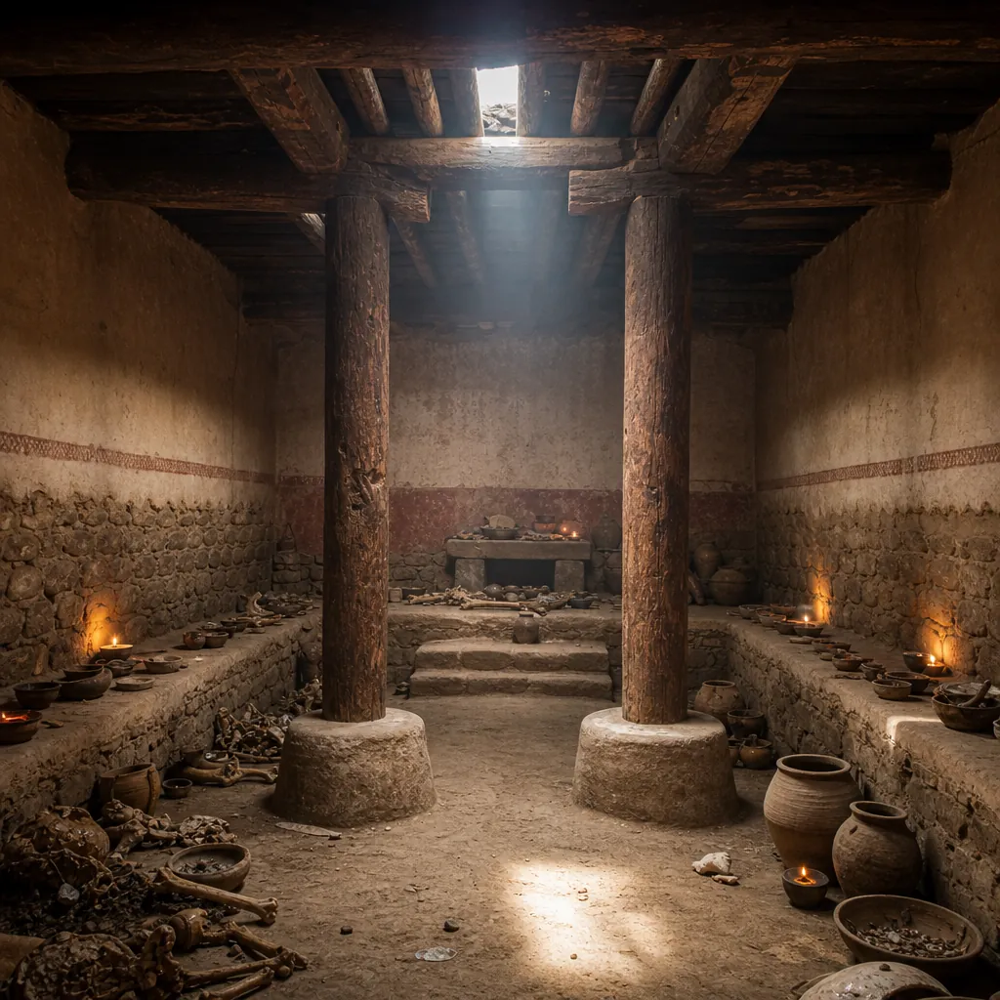

# Judges 16 - Background & Links

*A Philistine temple hall of the kind excavated at Tell Qasile, its roof carried on two central pillars (16:29).*

**Passage snapshot**  
The end of Samson. A night in Gaza and the city gates carried off, then Delilah in the Valley of Sorek wearing him down through four rounds until the last strand of the vow is cut. Blinded, bound and grinding in a Philistine prison, he brings the temple of Dagon down on himself and on three thousand.

## Map of the text
- 16:1-3: Samson visits a prostitute in Gaza; ambushed at the gate, he tears the doors, posts and bar out of the wall and carries them uphill toward Hebron.
- 16:4-17: He loves Delilah in the Valley of Sorek; the five Philistine lords each offer eleven hundred pieces of silver; four rounds of questioning - seven fresh bowstrings, new ropes, seven locks woven into the loom, and at last the truth.
- 16:18-22: The hair is shaved; "he did not know that the LORD had departed from him" (16:20); his eyes are gouged out, he is bound in bronze and set to grind in the prison; the hair begins to grow.
- 16:23-30: A festival to Dagon; three thousand on the roof; Samson asks the attendant to let him feel the two central pillars, prays to be avenged for his two eyes, and pushes.
- 16:31: His family carry him up and bury him between Zorah and Eshtaol, in the tomb of Manoah. He had judged Israel twenty years.

## Historical-cultural background (what an ancient Israelite would notice)
- Gaza was the southernmost of the five Philistine cities. Carrying its gates thirty-odd miles uphill toward Hebron is not just a feat of strength but a public humiliation of the city: the gate was its defence, its courthouse and its identity.
- Eleven hundred pieces of silver from each of five lords is an enormous sum. The same figure turns up in Judges 17:2 in Micah's household, and the repetition may be deliberate; either way, Delilah is being offered a fortune, and the narrative never says she was Philistine.
- Excavations at Tell Qasile uncovered a Philistine temple whose roof was carried on two central wooden pillars set on stone bases, close enough together for one person to reach both. The architecture the chapter describes is the architecture archaeologists have found.
- Dagon was a grain deity long established in the region and adopted by the Philistines. A victory festival crediting him with delivering Samson sets up the confrontation, and the same god is humiliated again before the ark in 1 Samuel 5.
- Blinding captives was ordinary practice for a dangerous prisoner, and grinding at the mill was the work of women and slaves. Both are calculated degradation, not just confinement.
- The hair is the last of the three Nazirite marks to go. Corpse, wine, hair: the vow of Numbers 6 is now entirely spent, and the narrator has been counting.

## Audience needs (why this mattered to Israel)
- Verse 20 is the sentence the chapter exists for. Samson goes out "as at other times" and does not know the LORD has left him. A people trading on inherited privilege needed to hear that the presence of God can withdraw without any felt announcement.
- The book has been arguing since chapter 2 that Israel cannot save itself. Its greatest strongman ends blind and shackled at an enemy festival, which is precisely the trajectory the audience's own history was taking.
- Samson's last prayer asks for vengeance for his two eyes, not for Israel's deliverance. Even at the end the frame is personal, and the narrator lets that stand without comment.

## Canonical placement
- The close of the judge cycles, immediately before the appendices of chapters 17-21 and their refrain about there being no king in Israel.
- Samson's fate is Israel's future in miniature: set apart, empowered, entangled with the nations, then blinded, bound and labouring in a foreign land. The exile is prefigured in one body.
- The withdrawal of the Spirit in 16:20 anticipates the same withdrawal from Saul (1 Sam 16:14) and frames the question the monarchy will have to answer.

## Scripture links
- Nazirite hair: Num 6:5, and the birth announcement of Judg 13:5.
- The Spirit departing: 1 Sam 16:14, of Saul.
- Dagon humiliated: 1 Sam 5:1-5, where the god who supposedly captured Samson falls before the ark.
- Eleven hundred pieces of silver: Judg 17:2, the same odd sum in the next narrative.
- Foreign women turning the heart: Deut 7:3-4; and the pattern named of Solomon in 1 Kgs 11:1-8.
- Samson appears in the roll of faith at Heb 11:32, listed for what God did through him rather than for how he lived.

## Message to the first hearers
- Strength that comes from God is not owned. Samson treats it as a personal property and only discovers otherwise when he reaches for it and finds nothing.
- The loss is gradual and unnoticed. Nothing in chapter 16 is a sudden fall; it is the last step of a walk that started with what looked right in his own eyes.
- God still answers the flawed prayer. The final act is granted, and it is also the death of a man who never once asked for his people.
- A nation that keeps its consecration only as a story about itself will end where Samson ended, and the book knows it.
