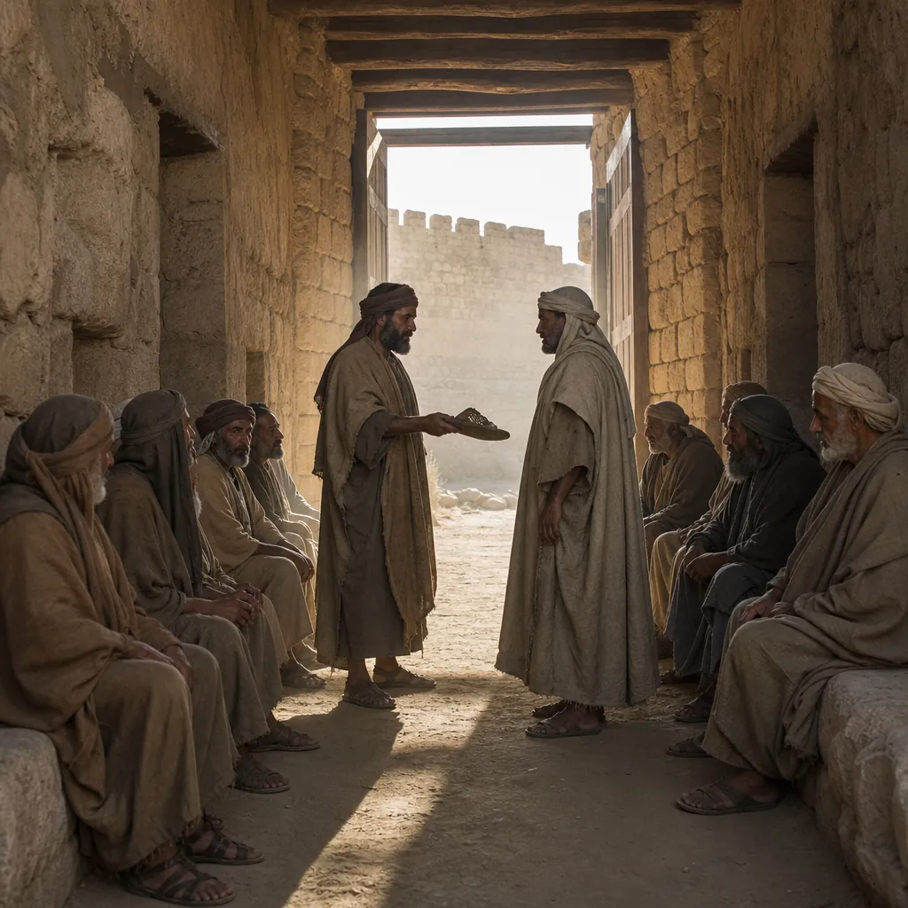

# Ruth 4 - Background & Links

*The sandal handed over in the gate before ten seated elders, the way a transaction was sealed "in former times in Israel" (4:2, 4:7).*

**Passage snapshot**  
Boaz takes the case to the gate and puts it to the man with the prior claim, who agrees to redeem the field until he hears what comes with it. A sandal changes hands, the claim passes to Boaz, and a child is born whom the women of Bethlehem name for Naomi. A ten-name genealogy then runs the whole village story out to David.

## Map of the text
- 4:1-2: Boaz goes up to the gate and sits down; the nearer redeemer passes and is called over as *peloni almoni*, roughly "so-and-so, whoever you are"; ten elders sit as witnesses.
- 4:3-4: Naomi is selling the parcel of land that belonged to Elimelech; Boaz offers the closer kinsman first refusal. "I will redeem it."
- 4:5-6: Boaz adds the condition - taking the field means taking Ruth the Moabite, so as to raise up the name of the dead over his inheritance. The man withdraws: "lest I impair my own inheritance."
- 4:7-8: The narrator stops to explain an obsolete custom - to confirm a transaction a man drew off his sandal and handed it over. The sandal is handed over.
- 4:9-12: Boaz declares before the witnesses that he has acquired all that was Elimelech's, Chilion's and Mahlon's, and Ruth as his wife. The elders bless him: may this woman be like Rachel and Leah, who together built up the house of Israel; may your house be like the house of Perez, whom Tamar bore to Judah.
- 4:13-17: A son is born; the women bless the LORD for not leaving Naomi without a redeemer, and call Ruth better to her than seven sons; Naomi takes the child to her bosom; the neighbourhood women name him Obed.
- 4:18-22: Ten generations, Perez to David.

## Historical-cultural background (what an ancient Israelite would notice)
- The gate of an Iron Age town was a chambered structure with stone benches in the side rooms, and it was where public business happened: contracts, disputes, the elders' court (Deut 21:19; Amos 5:10; Prov 31:23). Boaz does not arrange a private deal. He goes to the one place where everything said is on the record.
- The nearer kinsman is never named. In a chapter obsessed with preserving the name of the dead, the man who protects his own estate rather than raise up a name is left as "so-and-so" in perpetuity. That is the narrator's judgement, delivered entirely by omission.
- Two separate institutions are being run together here. Land redemption (Lev 25:25) obliges the nearest relative to buy back a kinsman's holding; levirate marriage (Deut 25:5-10) obliges a brother to father a son for a man who died childless. Boaz is not a brother, and no law requires what he does. The book presents a customary practice broader than the statutes, or a man going beyond them.
- The sandal in 4:7 is explained because the audience no longer recognised it, which tells you the book was written well after the events. Note also what it is not: in Deut 25:9 the widow pulls the sandal off the refusing brother and spits in his face, and his house is nicknamed for it. Here the ceremony is a straight property transfer with no shaming, and the narrator lets the refuser leave with his dignity even as he loses his name.
- The Hebrew of 4:5 is famously awkward, with the written text reading "I acquire" and the reading tradition "you acquire". Either way, the point of the verse is that Ruth is not a separable extra to the deal.
- "Lest I impair my own inheritance" is a real calculation, not villainy. A son born to Ruth would inherit the field the man had just paid for, and would carry Mahlon's name rather than his. He is doing arithmetic; Boaz is doing *hesed*.
- The elders bless with Rachel and Leah, the two matriarchs who were also outsiders brought in by marriage, and with Tamar, whose son Perez came from the other irregular levirate story in Israel's memory (Gen 38). Bethlehem's elders reach for precisely the ancestors whose family arrangements were unusual.
- The women, not the parents, name the child (4:17), and they name him as Naomi's. The book began with a woman who said "call me Mara, for the Almighty has dealt bitterly with me" (1:20); it ends with the same women declaring a son born to her.

## Audience needs (why this mattered to Israel)
- Deuteronomy 23:3 bars a Moabite from the assembly of the LORD to the tenth generation. The genealogy that closes this book runs ten names from Perez to David, and a Moabite stands in the middle of it. The book is not ignoring the law; it is setting a case in front of it, and the case is a woman who said "your people shall be my people, and your God my God" (1:16).
- An audience that had watched national leadership collapse needed to be shown covenant faithfulness working at the scale it actually operates: a field, a widow, a village court, a man who could have said no.
- The famine that opened the book is answered not by a judge or a deliverer but by an ordinary harvest, an ordinary marriage and an ordinary birth. For readers formed by the cycle of Judges, that is the point.
- The line "who has not left you this day without a redeemer" (4:14) is spoken about a newborn, to a woman who had declared herself empty. Naomi's emptiness is the problem the book has been carrying since 1:21, and it is filled by a child rather than a restoration of what she lost.

## Canonical placement
- In Christian Bibles Ruth sits between Judges and 1 Samuel, and it reads as the answer to both: an alternative to "everyone did what was right in his own eyes" (Judg 21:25), and the run-up to the king Samuel will anoint. In the Hebrew canon it sits among the Writings as one of the five scrolls, read at the harvest festival of Shavuot.
- The genealogy is the hinge of the whole storyline: Judah and Tamar (Gen 38) produce Perez; Perez produces, ten names later, David; and the promise to Judah of a ruler's staff (Gen 49:10) finds its road home through a Moabite widow.
- Boaz as *go'el* stands in a line of redemption language that runs from the exodus (Exod 6:6) through Job's confidence that "my redeemer lives" (Job 19:25) to Isaiah's Redeemer of Israel, and it always means a family obligation taken up at cost.

## Scripture links
- Land redemption by the nearest kinsman: Lev 25:25-28.
- Levirate marriage and the sandal ceremony: Deut 25:5-10.
- Moabites and the assembly: Deut 23:3-6, the law the book puts under pressure.
- Tamar and Perez: Gen 38, the other levirate story, named aloud by the elders in 4:12.
- Rachel and Leah building the house of Israel: Gen 29-30.
- Bethlehem Ephrathah, small among the clans: Mic 5:2.
- David's descent: 1 Sam 16:1-13; 1 Chr 2:5-15, which repeats this genealogy.
- Ruth in the line of Jesus: Matt 1:5, alongside Tamar, Rahab and the wife of Uriah.

## Message to the first hearers
- Redemption is expensive and voluntary. The law could not compel Boaz; the nearer kinsman was within his rights; the difference between the two men is not legality but willingness to absorb a loss for someone else's name.
- Belonging is settled by allegiance, not ancestry. Ruth is called "the Moabite" right up to 4:10, after which the narrator drops the label. She is not assimilated quietly; she is received openly, in front of witnesses, as who she is.
- God's work in this book is invisible while it happens. There is no angel, no oracle, no deliverer. There is a harvest, a gate, a marriage and a birth, and only the last three verses reveal what was being built.
- Emptiness is not the last word over Naomi, but neither is restoration of the old life. Her sons do not come back. What she is given is a future she did not have before, carried by a foreigner who loved her.
